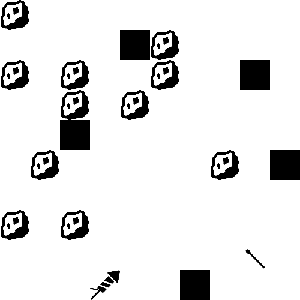

# Fireworks_Simulator_Twiter_Bot
A Twitter bot that creates tiny fireworks simulations.

This bot was created by Akiva Krauthamer as an IACD project. You can view the bot in action on Twiter @Fireworks_Sim.

The bot posts to Twitter using Node.js and the Twit library. The simulation and gif are created in Processing.

The rules are of the simulation are simple enough:
-Rocks fall down.
-Rocks that fall past matches light the match.
-A match on fire next to a firework causes the firework to shoot in to the air.

Due to the random nature of the starting state of the simulation not every tweet will have a successful fireworks launch. The goal behind this choice was to encourage followers to check back in to see if the bot had accomplished it's goal.
